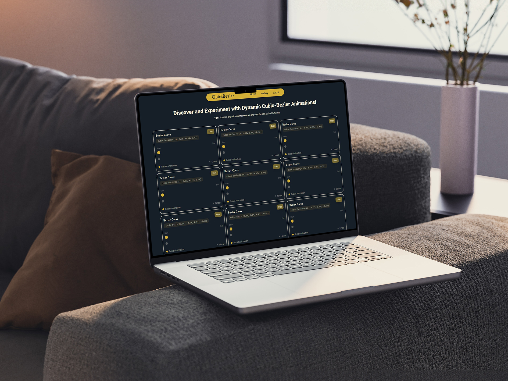

# Quick Bezier

Quick Bezier is a React.js project that provides an intuitive and refreshed interface for creating and visualizing Bezier animations. This tool is designed to help developers and designers easily access and customize Bezier animations for their web projects.



## Features

- **Interactive Bezier animation preview**: Visualize and tweak Bezier curves in real-time.
- **Export curve data**: Easily export curve data for use in your web projects.
- **Modern UI**: A fresh and modern UI with a new color theme, updated Navbar, Bezier Cards, and Footer.

## Installation

To get started with Quick Bezier, clone the repository and install the necessary dependencies:

```bash
git clone https://github.com/rudra-xi/quick-bezier.git
cd quick-bezier
npm install
```

## Usage

### Running the Project

To start the development server, run:

```sh
npm run dev
```

This will start the Vite development server and you can view the project in your browser at `http://localhost:6393`.

### Building for Production

To build the project for production, run:

```sh
npm run build
```

This will create a `dist` directory with the production build of your project.

## Deployment

The project is deployed and can be accessed at: [](https://quick-bezier.netlify.app/)

## Important Dependencies

- **React**: A JavaScript library for building user interfaces.
- **Vite**: A fast build tool and development server.
- **TailwindCSS**: A utility-first CSS framework for rapid UI development.
- **React Hot Toast**: A library for creating toast notifications in React.

## Contributing

We welcome contributions to Quick Bezier! If you have any ideas, suggestions, or bug reports, please open an issue or submit a pull request.

1. Fork the repository.
2. Create a new branch (`git checkout -b feature-branch`).
3. Make your changes.
4. Commit your changes (`git commit -m 'Add some feature'`).
5. Push to the branch (`git push origin feature-branch`).
6. Open a pull request.

## Roadmap

Here are some planned features and improvements for the future:

- **Curve Graph**: Introduce a graph feature to visualize custom animations.
- **Integration with design tools**: Allow seamless integration with popular design tools.
- **Enhanced accessibility features**: Improve accessibility for all users.

**_Your feedback and suggestions are welcome to help shape the future of this project!_**

## Acknowledgements

- [](https://vitejs.dev/)
- [](https://reactjs.org/)
- [](https://en.wikipedia.org/wiki/B%C3%A9zier_curve)
- [](https://tailwindcss.com/)
- [](https://github.com/yourusername/react-hot-toast)

## Author

[](https://github.com/rudra-xi)

## Contact

[](https://www.instagram.com/rudra.xii/)
[](https://www.linkedin.com/in/goutam-rudraxi)

## License

This project is licensed under the MIT License. See the [](/LICENSE) file for more information.
